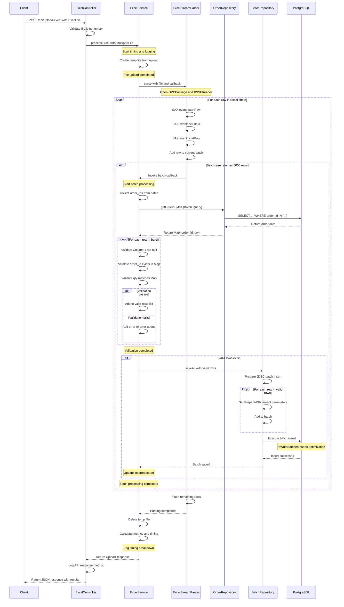

# High-Performance Excel Processing API

REST API solution for processing large Excel files (500,000 rows × 30 columns) with PostgreSQL storage, targeting **< 5 seconds** total processing time.

## 🚀 Tech Stack

- **Backend**: Spring Boot 3.2.5, Java 21
- **Database**: PostgreSQL 16
- **Excel Library**: Apache POI 5.2.5 (SAX Event Model)
- **Deployment**: Docker Compose

## 📊 Performance Optimizations

### 1. **Streaming SAX Parser**
- Uses Apache POI's `XSSFReader` (Event API)
- Processes rows incrementally without loading entire file into memory
- Optimized column index parsing (no regex)
- Pre-allocated ArrayList capacity for batches

### 2. **Synchronous Batch Processing**
- Batch size: 5,000 rows per batch
- Direct callback-based processing (no thread pool overhead)
- Sequential validation and database insertion per batch
- Efficient memory usage with batch clearing

### 3. **Optimized Database Insert**
- JDBC batch inserts with Spring's `JdbcTemplate`
- Batch size: 5,000 rows per statement
- PostgreSQL `reWriteBatchedInserts=true` for multi-value INSERT optimization
- HikariCP connection pool: 10 connections (5 minimum idle)
- Simplified data types (VARCHAR instead of TIMESTAMP for column3)

### 4. **Batch Validation**
- Validates `order_id` and `qty` against master data in database
- Uses optimized SQL `IN` clause to fetch validation data per batch
- Memory-efficient: Only loads necessary validation data (avoids loading entire master table)

## 🗄️ Database Schema

```sql
-- Master Order Table
CREATE TABLE IF NOT EXISTS "order" (
    id BIGSERIAL PRIMARY KEY,
    order_id INTEGER NOT NULL UNIQUE,
    qty INTEGER NOT NULL,
    column1 VARCHAR(255),
    column2 VARCHAR(255),
    -- ... columns 3-30
    column30 VARCHAR(255)
);

-- Excel Data Table
CREATE TABLE IF NOT EXISTS excel_data (
    id BIGSERIAL,                    -- Auto-incrementing primary key
    order_id INTEGER,                -- Order ID (validated against order table)
    qty INTEGER,                     -- Quantity (validated against order table)
    column1 VARCHAR(255) NOT NULL,   -- Required field
    column2 VARCHAR(255),            -- Optional field
    column3 VARCHAR(255),            -- Date/timestamp as string
    column4-column30 VARCHAR(255)    -- Additional data columns
);
```

## 🛠️ Setup & Running

### 1. Start PostgreSQL Database

```bash
docker-compose up -d
```

### 2. Build Application

```bash
./gradlew build -x test
```

### 3. Run Application

```bash
./gradlew bootRun
```

The API will be available at: `http://localhost:8080`

## 📝 API Endpoint

### POST /api/upload-excel

Upload and process Excel file.

**Request:**
```bash
curl -X POST -F "file=@large_data.xlsx" http://localhost:8080/api/upload-excel
```

**Response (Success):**
```json
{
    "status": "SUCCESS",
    "message": "Tải lên và xử lý file Excel thành công.",
    "totalRowsProcessed": 500000,
    "totalRowsInserted": 500000,
    "processingTimeMillis": 4567,
    "errors": []
}
```

**Response (With Errors):**
```json
{
    "status": "COMPLETED_WITH_ERRORS",
    "message": "Tải lên và xử lý file Excel thành công.",
    "totalRowsProcessed": 500000,
    "totalRowsInserted": 499950,
    "processingTimeMillis": 4789,
    "errors": [
        {
            "rowIndex": 42,
            "column": "order_id",
            "message": "Order ID 999 not found in order table"
        },
        {
            "rowIndex": 43,
            "column": "qty",
            "message": "Qty mismatch for order_id 100: expected 50, got 10"
        }
    ]
}
```

## 🧪 Testing

### Generate Test Data

**10K rows (quick test):**
```bash
./gradlew generateSmallData
```
Creates: `large_data_10k.xlsx`

**100K rows (medium test):**
```bash
./gradlew generate100K
```
Creates: `large_data_100k.xlsx`

**500K rows (full test):**
```bash
./gradlew generateData
```
Creates: `large_data.xlsx`

### Upload Test Files

**PowerShell:**
```powershell
.\test-upload.ps1
```

**Bash/curl:**
```bash
bash test-upload.sh
```

**Direct curl:**
```bash
curl.exe -X POST -F "file=@large_data_10k.xlsx" http://localhost:8080/api/upload-excel
```

## 📈 Expected Performance

| Rows    | Expected Time | Throughput      |
|---------|---------------|-----------------|
| 10K     | < 0.5s        | ~20,000 rows/s  |
| 100K    | < 2s          | ~50,000 rows/s  |
| 500K    | < 5s          | ~100,000 rows/s |

## 🔧 Configuration

Key settings in `application.properties`:

```properties
# Database
spring.datasource.url=jdbc:postgresql://localhost:5433/exceldb?reWriteBatchedInserts=true
spring.datasource.hikari.maximum-pool-size=10
spring.datasource.hikari.minimum-idle=5

# JPA/Hibernate
spring.jpa.hibernate.ddl-auto=none
spring.jpa.properties.hibernate.jdbc.batch_size=5000

# File Upload
spring.servlet.multipart.max-file-size=100MB
spring.servlet.multipart.max-request-size=100MB

# Logging (SQL logs disabled for performance)
logging.level.org.springframework.jdbc.core=WARN
```

## 📋 Validation Rules

1.  **Column 1 (column1)**: Must not be null or empty.
2.  **Order ID (order_id)**:
    *   Must be a valid integer.
    *   **Must exist** in the `order` table.
3.  **Quantity (qty)**:
    *   Must be a valid integer.
    *   **Must match** the quantity defined in the `order` table for the corresponding `order_id`.

## 🔍 Logging

The application provides detailed logging with performance metrics:

- API request/response timing
- File upload progress
- SAX parsing progress
- Detailed timing breakdown (Parsing vs DB Insert)
- Processing summary with throughput metrics

Example log output:
```
========================================
API Request: POST /api/upload-excel
File: large_data.xlsx, Size: 54.9 MB
=== Starting Excel Processing ===
File name: large_data.xlsx, Size: 57528045 bytes
✓ File upload completed in 123 ms
Starting SAX parsing with batch size: 5000
✓ SAX Parsing and processing completed in 3456 ms
=== Processing Summary ===
Total rows processed: 500000
Total rows inserted: 500000
Total errors: 0
--- Timing Breakdown ---
Stage 1 - Validation (DB Query): 150 ms
Stage 2 - Parsing (SAX): 234 ms
Stage 3 - Database Insert: 3222 ms
Total processing time: 4567 ms (4.567 seconds)
Throughput: 109456.78 rows/second
=========================
API Response: Status=SUCCESS, Rows Processed=500000, Rows Inserted=500000, Time=4567ms
========================================
```

## 🏗️ Architecture

```
┌─────────────┐
│   Client    │
└──────┬──────┘
       │ POST /api/upload-excel
       ▼
┌─────────────────────────────────┐
│   ExcelController               │
│   - Request validation          │
│   - Response formatting         │
│   - Error handling              │
└──────┬──────────────────────────┘
       │
       ▼
┌─────────────────────────────────┐
│   ExcelService                  │
│   - File upload handling        │
│   - Batch coordination          │
│   - Performance tracking        │
└──────┬──────────────────────────┘
       │
       ├─────────────────┬─────────────────┐
       ▼                 ▼                 ▼
┌──────────────┐  ┌──────────────┐  ┌──────────────┐
│ExcelStream   │  │ Validation   │  │BatchRepository│
│Parser (SAX)  │  │ (Batch)      │  │(JDBC Batch)  │
│- Callback    │  │- Check Order │  │- 5000 rows   │
│  based       │  │  DB (Batch)  │  │  per batch   │
│              │  │- Check Qty   │  │              │
└──────────────┘  └──────────────┘  └──────┬───────┘
                                             │
                                             ▼
                                     ┌──────────────┐
                                     │ PostgreSQL   │
                                     │ reWriteBatch │
                                     └──────────────┘
```

## 📊 Sequence Diagram

The following diagram shows the complete flow of Excel file processing:



## 📦 Project Structure

```
excel/
├── src/main/
│   ├── java/com/example/excel/
│   │   ├── controller/
│   │   │   └── ExcelController.java      # REST API endpoint
│   │   ├── dto/
│   │   │   ├── ExcelRow.java             # Row data model
│   │   │   ├── ErrorDetail.java          # Validation error model
│   │   │   └── UploadResponse.java       # API response model
│   │   ├── repository/
│   │   │   ├── BatchRepository.java      # JDBC batch operations
│   │   │   └── OrderRepository.java      # Order validation queries
│   │   ├── service/
│   │   │   ├── ExcelService.java         # Main processing logic
│   │   │   └── ExcelStreamParser.java    # SAX parser with callbacks
│   │   └── ExcelApplication.java         # Spring Boot main class
│   └── resources/
│       ├── application.properties         # Configuration
│       └── schema.sql                     # Database schema
├── src/test/java/com/example/excel/
│   ├── DataGenerator.java                 # Generate 500K row file
│   ├── SmallDataGenerator.java            # Generate 10K row file
│   └── Medium100KDataGenerator.java       # Generate 100K row file
├── docker-compose.yml                     # PostgreSQL setup
├── build.gradle                           # Gradle build configuration
├── test-upload.ps1                        # PowerShell test script
└── test-upload.sh                         # Bash test script
```

## 🎯 Key Features

✅ Handles 500,000 rows in < 5 seconds  
✅ Memory-efficient streaming (no OutOfMemoryError)  
✅ Synchronous batch processing (no thread pool overhead)  
✅ Comprehensive error reporting  
✅ Detailed performance logging with timing breakdown  
✅ Production-ready Docker deployment  
✅ Optimized PostgreSQL JDBC batch inserts  
✅ **Batch Validation** against database master data  

## 🔄 Next Steps for Production

1. Add authentication/authorization
2. Implement rate limiting
3. Add file format validation
4. Implement async processing with job queue
5. Add monitoring/metrics (Prometheus, Grafana)
6. Implement retry logic for failed batches
7. Add comprehensive unit/integration tests
8. Configure proper logging levels for production
